# 🔗 Real-Time Data Streaming & Processing Pipeline — Powered by Airflow, Kafka, Spark, Cassandra, and Docker

✨ **Tools & Technologies Used:**

 **Apache Airflow**: Workflow orchestration  

 **Apache Kafka**: Real-time data streaming  

 **Apache Spark (Structured Streaming)**: Data processing and transformation  

 **Apache Cassandra**: NoSQL database for storage  

 **Docker & Docker Compose**: Containerization for seamless deployment  

 **Python**: Scripting and data processing  

 **Random Name API**: Source of random name data  


---

## 🎯 Project Overview

This project is a fully containerized, real-time data streaming and processing pipeline. It periodically fetches random user data from an external API, streams it through Kafka, processes it using Spark, and stores it in a Cassandra database. Docker is used to deploy all components effortlessly and maintain isolated environments.

### 🖥️ Architecture Diagram

```mermaid
graph TD
    API([🌐 Random Name API]) --> |🔄 Fetch Data| Python([🐍 Python Application])

    subgraph Docker

        Airflow([Apache Airflow]) <--> |🔄 Schedule Jobs| Python
        Python <--> |🔄 Stream Data| Kafka([Apache Kafka])
        Kafka <--> |🔄 Stream Data| Spark([Apache Spark])
        Spark --> |📝 Write Data| Cassandra([Apache Cassandra])
    end

    Docker --> Airflow
    Docker --> Kafka
    Docker --> Spark
    Docker --> Cassandra

    subgraph Docker
        Airflow[Apache Airflow] <--> Python
        Python <--> |Streaming| Kafka[Apache Kafka]
        Kafka <--> |Streaming| Spark[Apache Spark]
        Spark --> |Batch Write| Cassandra[Apache Cassandra]
    end

    Docker --> Airflow
    Docker --> Kafka
    Docker --> Spark
    Docker --> Cassandra
```



---

## 📌 How It Works

1. **Apache Airflow** triggers a script every 10 seconds to fetch data from an external random names API.
2. The data is then published to an **Apache Kafka** topic (`random_names`).
3. **Apache Spark** (Structured Streaming) consumes messages from Kafka, processes them, and writes the results to **Apache Cassandra**.

---

## 📂 Project Files

* `stream_to_kafka_dag.py`: Airflow DAG script for scheduling API data fetch every 10 seconds.
* `stream_to_kafka.py`: Fetches data from the API and sends it to Kafka.
* `spark_streaming.py`: Consumes data from Kafka with Spark and writes to Cassandra.
* `response.json`: Sample API response.

---

## ⚙️ Setup and Installation

### 🐳 Step 1: Clone the Repository

```bash
git clone https://github.com/mahdimirmojarabian/real-time-data-pipeline-airflow-kafka-spark-cassandra-docker.git
```

### 🐋 Step 2: Docker Configuration

#### 📌 Build Airflow Docker Container

Run once to build your customized Airflow container:

```bash
docker build --rm \
  --build-arg AIRFLOW_DEPS="datadog,dask" \
  --build-arg PYTHON_DEPS="flask_oauthlib>=0.9" \
  -t puckel/docker-airflow .
```

Replace the existing `docker-compose-LocalExecutor.yml` file with the provided one, and add `requirements.txt`.

Launch the containers:

```bash
docker-compose -f docker-compose-LocalExecutor.yml up -d
```

Access Airflow UI: `http://localhost:8080`

---

### 📨 Apache Kafka Setup

Launch Kafka cluster and Cassandra:

```bash
docker-compose up -d
```

Access Kafka UI: `http://localhost:8888`

Create Kafka topic:

* Topic name: `random_names`

---

### 🗃️ Apache Cassandra Setup

Access Cassandra CLI:

```bash
docker exec -it cassandra /bin/bash
cqlsh -u cassandra -p cassandra
```

Create Cassandra keyspace and table:

```sql
CREATE KEYSPACE spark_streaming WITH replication = {'class':'SimpleStrategy','replication_factor':1};

CREATE TABLE spark_streaming.random_names(
  full_name text PRIMARY KEY,
  gender text,
  location text,
  city text,
  country text,
  postcode int,
  latitude float,
  longitude float,
  email text
);
```

---

### ▶️ Running the Data Pipeline

#### 📂 Airflow DAGs

Place the files `stream_to_kafka.py` and `stream_to_kafka_dag.py` inside Airflow's `dags` folder.

Activate the DAG `random_people_names` in Airflow's web UI (`http://localhost:8080`). Data will begin streaming every 10 seconds.

#### 🔥 Spark Streaming

Copy Spark script to container:

```bash
docker cp spark_streaming.py spark_master:/opt/bitnami/spark/
```

Enter the Spark container and install required JAR files:

```bash
docker exec -it spark_master /bin/bash
cd jars
curl -O https://repo1.maven.org/maven2/com/datastax/spark/spark-cassandra-connector_2.12/3.3.0/spark-cassandra-connector_2.12-3.3.0.jar
curl -O https://repo1.maven.org/maven2/org/apache/spark/spark-sql-kafka-0-10_2.13/3.3.0/spark-sql-kafka-0-10_2.13-3.3.0.jar
```

Submit Spark streaming job:

```bash
spark-submit --master local[2] \
  --jars /opt/bitnami/spark/jars/spark-sql-kafka-0-10_2.13-3.3.0.jar,/opt/bitnami/spark/jars/spark-cassandra-connector_2.12-3.3.0.jar \
  spark_streaming.py
```

Data from Kafka will now be continuously written to Cassandra.

---
